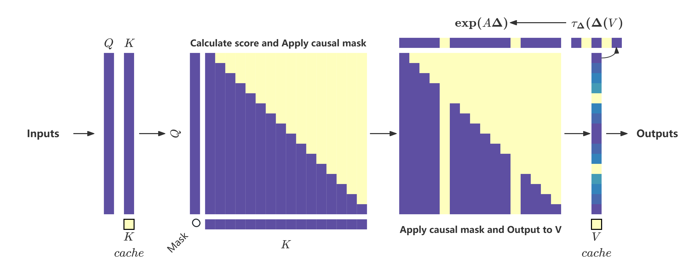

<!-- coding=utf-8
Copyright 2024 Jingze Shi and Bingheng Wu. All rights reserved.

This code is based on the Wonderful Matrices paper implementation.

    https://arxiv.org/abs/2412.11834

Licensed under the Apache License, Version 2.0 (the "License");
you may not use this file except in compliance with the License.
You may obtain a copy of the License at

    http://www.apache.org/licenses/LICENSE-2.0

Unless required by applicable law or agreed to in writing, software
distributed under the License is distributed on an "AS IS" BASIS,
WITHOUT WARRANTIES OR CONDITIONS OF ANY KIND, either express or implied.
See the License for the specific language governing permissions and
limitations under the License. -->


# Wonderful Matrices

<h4 align="center">
<p>

English | [简体中文](./README_zh.md)

</p>
</h4>


> **Wonderful Matrices: More Efficient and Effective Architecture for Language Modeling Tasks**\
> Jingze Shi*, Bingheng Wu*\
> Paper: [arXiv:2412.11834](https://arxiv.org/abs/2412.11834)





## About

This project is a continuation of the discussion section of the [Wonderful Matrices](https://arxiv.org/abs/2412.11834) paper.

We hope to further explore whether the Transformer framework allows for more complex feedforward network structures by training a small language model (SLM) based on the `Doge` architecture, enabling the model to have fewer cache states and larger knowledge capacity.

We also hope to use open-source tools and frameworks as much as possible to simplify the process from data processing to model training, so that beginners can easily understand and use them.


## Requirements

- Windows or Linux
- NVIDIA GPU
- Python 3.10+
- PyTorch 2.0+
- CUDA 11.8+

We highly recommend that you install the latest version of PyTorch and CUDA for optimal performance.

Of course, you can also use the open-source [Docker PyTorch](https://catalog.ngc.nvidia.com/orgs/nvidia/containers/pytorch) image to avoid the hassle of configuring the environment.

```bash
docker pull nvcr.io/nvidia/pytorch:24.10-py3
docker run --privileged --gpus all -it --name PyTorch --shm-size=32g -p 8888:8888 -p 6006:6006 --ulimit memlock=-1 --ulimit stack=67108864 -v <your code path>:/workspace -v <your datasets path>:/workspace/Doge/datasets nvcr.io/nvidia/pytorch:24.10-py3
```

- `pip install transformers`: The core framework for all subsequent work.
- `pip install datasets sentencepiece boto3`: Used to download and process datasets.
- `pip install accelerate`: Used for distributed training.
- `pip install einx`: Fast implementation dependency for the CDMoE module.

## Installation

```bash
git clone https://github.com/LoserCheems/WonderfulMatrices.git
cd WonderfulMatrices
pip install -e .
```

## Usage

We have written a [notebook](./examples/notebook.ipynb) (still being updated) to demonstrate the entire process of datasets processing, model training, and model evaluation. 
You can use the following complete architecture or individual modules.

### Cheems Architecture

The modeling code of the Cheems architecture.

Source code: [modeling_cheems.py](./src/wonderful_matrices/models/modeling_cheems.py)

Usage:

```python
import torch
from wonderful_matrices.model.configuration_cheems import CheemsConfig
from wonderful_matrices.model.modeling_cheems import CheemsForCausalLM
from transformers import AutoTokenizer

tokenizer = AutoTokenizer.from_pretrained("<your_model_path_or_name>")
config = CheemsConfig()
model = CheemsForCausalLM(config)
input_ids = tokenizer("Hi, how are you today?", return_tensors="pt")
outputs = model.generate(**input_ids, max_length=100)
print(tokenizer.batch_decode(outputs))
```

### Doge Architecture

The modeling code of the Doge architecture.

Source code: [modeling_doge.py](./src/wonderful_matrices/models/modeling_doge.py)

Usage:

```python
import torch
from wonderful_matrices.model.configuration_doge import DogeConfig
from wonderful_matrices.model.modeling_doge import DogeForCausalLM
from transformers import AutoTokenizer

tokenizer = AutoTokenizer.from_pretrained("<your_model_path_or_name>")
config = DogeConfig()
model = DogeForCausalLM(config)
input_ids = tokenizer("Hi, how are you today?", return_tensors="pt")
outputs = model.generate(**input_ids, max_length=100)
print(tokenizer.batch_decode(outputs))
```

### Dynamic Mask Attention Module

The sequence transformation module of the Doge model.

Source code: [dmattn.py](./src/wonderful_matrices/modules/dmattn.py)

Usage:

```python
import torch
from wonderful_matrices.modules.dmcattn import DMAttn

batch, seq_len, dim = 2, 16, 64
x = torch.rand(batch, seq_len, dim)
attention_mask = torch.ones(batch, seq_len)
attn = DMAttn(
    d_model=dim,
    n_heads=1,
    max_position_embeddings=seq_len,
    layer_idx=0,
)
y, past_key_values = attn(x, attention_mask)
print(f"Input shape: {x.shape}, Output shape: {y.shape}")
```

### Cross Domain Mixture of Experts Module

The state transformation module of the Doge model.

Source code: [cdmoe.py](./src/wonderful_matrices/modules/cdmoe.py)

Usage:

```python
import torch
from wonderful_matrices.modules.cdmoe import CDMoE

batch, seq_len, dim = 2, 16, 64
x = torch.rand(batch, seq_len, dim)
cdmoe = CDMoE(
    d_model=dim,
    act_fn="silu",
    d_ff=dim * 4,
    d_private_expert_retrieval=64,
    n_experts=64,
    n_experts_heads=1,
    n_experts_per_head=2,
)
y = cdmoe(x)
print(f"Input shape: {x.shape}, Output shape: {y.shape}")
```

## Citation

If you use this codebase, or otherwise find our work valuable, please cite Doge:

```bibtex
@misc{shi2024wonderfulmatrices,
      title={Wonderful Matrices: More Efficient and Effective Architecture for Language Modeling Tasks}, 
      author={Jingze Shi and Bingheng Wu and Lu He and Luchang Jiang},
      year={2024},
      eprint={2407.16958},
      archivePrefix={arXiv},
      primaryClass={cs.LG},
      url={https://arxiv.org/abs/2407.16958}, 
}
```


